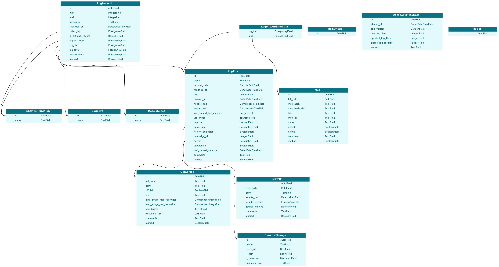

# Antistasi Logbook

## Dependencies

- httpx>=0.20.0
- webdav4>=0.9.3
- peewee>=3.14.4
- tzlocal>=4.1
- yarl>=1.7.0
- python-dateutil>=2.8.2
- Pillow>=8.4.0
- cryptography>=35.0.0
- click>=8.0.3
- attrs>=21.2.0
- rich>=10.12.0
- sortedcontainers>=2.4.0
- marshmallow>=3.14.0
- gidapptools>=0.1.9
- PySide6>=6.2.1

Also [APSW](https://github.com/rogerbinns/apsw)s

### Database

#### Type

Antistasi Logbook uses [SQLite](https://www.sqlite.org), actually it uses [APSW](https://github.com/rogerbinns/apsw) wrapper of SQLite.

#### ORM

[peewee](https://github.com/coleifer/peewee) is used as an orm to interact with the [SQLite](https://www.sqlite.org) database.

#### ERD

---

---